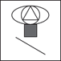

## インターフェイスにラスター画像を使用しない

### 識別子

| GreenIT |  V2  |  V3  |  V4  |
|:-------:|:----:|:----:|:----:|
|  161    | 21  | 35  |      |

### カテゴリ

| ライフサイクル |  サードパーティ  |  担当者  |
|:---------:|:----:|:----:|
| 5. 利用 | ユーザ/端末 | ユーザ |

### 効果

| 優先度 |      実装難易度       |  エコロジーへの影響度    |
|:-------------------:|:-------------------------:|:---------------------:|
| 4 | 4 | 4 |

|リソース                                      |
|:----------------------------------------------------------:|
|  ネットワーク  |

### 説明

画像の正しい形式を選ぶことは、不必要なバイトを転送せずに帯域幅を節約するために非常に重要です。
さらに、端末の多様化、画面サイズの変化、および解像度の向上に伴い、ベクター画像のアプローチが、ビットマップ画像よりも優先されるべきです。
この良い方法により、インターフェイスは画面の解像度から独立します。したがって、技術的な負債も制限します。
最初のルールは、ビットマップ画像（GIF、PNG、JPEG、WebPなど）を、スタイル（CSS）、ピクト、グリフ、またはwebfontまたは標準フォントによって提供されるアイコンに置き換えることです。インターネットユーザーは追加のリソースをダウンロードする必要はありません。
CSSまたは標準フォント（インターネットユーザーの端末にすでにインストールされている）を使用することができない場合、以下の方法も使用できます：
 - webfontを使用する ;
 - 標準SVG形式のベクター画像を使用する。

### 例

この198×198のピクセル画像の容量は : 
 - 圧縮されていないビットマップ形式で118KB
 - JPEGで6.5KB（90％圧縮）
 - PNGで3.8KB
 - PNGで3.8KB

この特定の場合、ベクター形式はビットマップ形式よりも5〜10倍軽く、無限にリサイズすることができます。

### 検証原理

| 検証項目     | 次の値以下である   |  
|-------------------|:-------------------------:|
| テストされたURLのビットマップ画像の数   | 5  |
