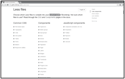

## JavaScriptライブラリやCSSフレームワークの必要な部分のみを使用する

### 識別子

| GreenIT |  V2  |  V3  |  V4  |
|:-------:|:----:|:----:|:----:|
|   811   | 77  | 40  |      |

### カテゴリ

| ライフサイクル |  サードパーティ  |  担当者  |
|:---------:|:----:|:----:|
| 2. 設計 | ネットワーク | ソフトウェアアーキテクト/開発者 |

### 効果

| 優先度 |      実装難易度       |  エコロジーへの影響度    |
|:-------------------:|:-------------------------:|:---------------------:|
| 4 | 4 | 4 |

|リソース                                      |
|:----------------------------------------------------------:|
|  プロセッサ  / RAM / ネットワーク |

### 説明

JavaScriptのライブラリ（例：jQuery）や即戦力となるCSSフレームワーク（Bootstrap、skeleton、gumby、foundationなど）は、サイトを素早く構築するための優れたツールであり、ほとんどの一般的なニーズに対応しています。
しかし、これらのフレームワークとライブラリのうち一般的に使用されるのはほんの一部であり、すべてがモジュラーなアーキテクチャに基づいているわけではないため、インターネット利用者はライブラリ全体をダウンロードし、機能のほんの一部しか使用しないという問題があります。

可能な限り、これらのライブラリを使用しない方が良いです（参照：https://youmightnotneedjquery.com）または、実際に使用されている部分だけを保持することです（参照：https://getbootstrap.com/customize）。

バンドラ（例：Webpack）を使用すると、簡単にツリーシェイキングを行い、使用されていない「死んだ」コードを削除することができます。

### 例

一部のフレームワーク、ここではBootstrapなどは、サイトで実際に使用されている部分だけを含むカスタムライブラリを作成することができます。これにより、ライブラリのサイズと実行時に消費されるリソースが削減されます。

### 検証原理

| 検証項目     | 次の値以下である   |  
|-------------------|:-------------------------:|
| 不必要な部分が使用されているライブラリの数  | 1  |
